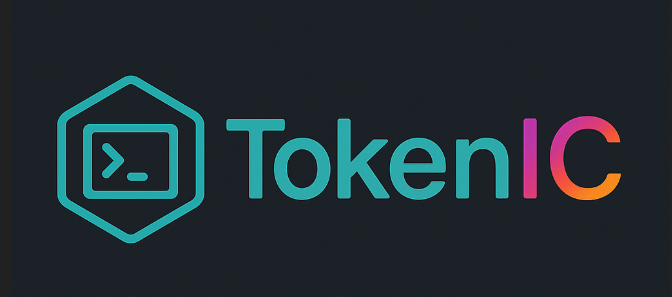

                           
   ver 1.0 

   ----------------------------------------------------
   Skrypt Bash do szybkiej konfiguracji Tokenów na ICP

   Wymagania:

   1) Skonfigurowane środowisko IC ( Lokalna Replika )
      Można to zrobić prosto i szybko innym skryptem z Tutoriala:

      https://youtu.be/FbvFtoTqpyA
      Link do skryptu z Tutoriala konfiguracji dfx:
      https://github.com/internetcomputerpol/ICP_Developerka_install/blob/main/ICP_Developerka_install.sh
   
   2) Uruchamiamy skrypt poleceniem
      Bash tokenic.sh
      Postępujemy zgodnie z kolejnymi krokami opisanymi kolejno
      alternatywnie na kanale InternetComputerPL znajdziecie
      tutorial obsługi skryptu i omównienie tworzenia tokenów
      w standardzie ICRC-1 / 2 na IC.

      Przydatne linki do własnych rozkinek:
      ( Cały kod dfx pobrany z oficjalnej strony Internet Computer )

      Link: https://internetcomputer.org/docs/tutorials/developer-liftoff/level-4/4.2-icrc-tokens

       Skrypty Token_List i Transfer
       Ułatwiają wyświetlanie salda tokena dla danego Identity przy pomocy narzędzia dfx

       Skrypt transer ułatwia i automatyzuje transfery pomiędzy Identity.

 

      -------------------------------------- Niech kod będzie z Wami
